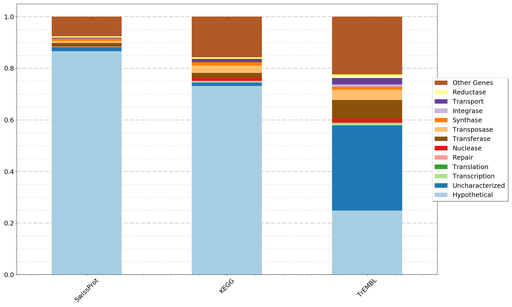

# Annotation Pipeline for TrEMBL, UniProt, and KEGG

This is a workflow for annotating amino acid sequences in fasta format using
the three databases. Includes steps to download and parse the
databases to match database query results with the annotation information as well as steps to combine, filter, and summarize the results. This workflow produces tables in tab separated value (tsv) format for the annotation of results of each each database. tsv files can be easily opened in Excel, or imported into Python with Pandas or read into R for further analysis. There is also an option to generate a stacked bar plot summary in .png format.

All of the Python scripts in this repository are written for Python version 3.6+. They can be executed and help output obtained by entering:

```bash
python scriptname.py -h
```

## Step 00: Required tools :: Blast+ (Blastp) and Kofamscan.

Kofamscan and hmm databases can be downloaded from the Download section of [this
page](https://www.genome.jp/tools/kofamkoala/).
The publication is [here](https://academic.oup.com/bioinformatics/advance-article/doi/10.1093/bioinformatics/btz859/5631907).


Or Kofamscan can be easily installed using a [conda environment](https://docs.conda.io/en/latest/miniconda.html):

```bash
conda create -n kofamscan hmmer parallel
conda activate kofamscan
conda install -c conda-forge ruby
```

Installation Details for Blast+ can be found [here](https://blast.ncbi.nlm.nih.gov/Blast.cgi?PAGE_TYPE=BlastDocs&DOC_TYPE=Download).

Or Blast+ can be easily installed using a [conda environment](https://docs.conda.io/en/latest/miniconda.html):

```bash
conda create -n blastplus
conda activate blastplus
conda install bioconda::blast=2.7.1 conda-forge::gnutls conda-forge::nettle
```

## Step 01: Download and parse databases.

There are various ways to download the databases. A straighforward approach is simply with wget:

```bash
wget ftp://ftp.uniprot.org/pub/databases/uniprot/current_release/knowledgebase/complete/uniprot_sprot.fasta.gz
wget ftp://ftp.uniprot.org/pub/databases/uniprot/current_release/knowledgebase/complete/uniprot_sprot.dat.gz
wget ftp://ftp.uniprot.org/pub/databases/uniprot/current_release/knowledgebase/complete/uniprot_trembl.fasta.gz
wget ftp://ftp.uniprot.org/pub/databases/uniprot/current_release/knowledgebase/complete/uniprot_trembl.dat.gz
wget 'https://www.genome.jp/kegg-bin/download_htext?htext=ko00001&format=htext&filedir=' -O ko00001.keg
```

Need to make blast databases for SwissProt and TrEMBL fasta sequences.

```bash
makeblastdb -dbtype prot -in uniprot_sprot.fasta
makeblastdb -dbtype prot -in uniprot_trembl.fasta
```

I wrote some python code to parse these database .dat files for use downstream (Parsing the TrEMBL.dat file can take 3-4 hours).

```bash
python 01a_Parse_UniProtDBs_datFile.py -i uniprot_sprot.dat -o uniprot_sprot.PARSED.dat.tsv
python 01a_Parse_UniProtDBs_datFile.py -i uniprot_trembl.dat -o  uniprot_trembl.PARSED.dat.tsv
```

## Step 02: Run Blastp or Kofamscan as desired.

Blastp can be run with similar to this (the -outfmt 6 format order is required for downstream processing):

```bash
blastp -task 'blastp' -evalue 0.01 -max_target_seqs 10 -num_threads 2 -db {pathto_db} -query {input_fasta} -out {outfile_name} -outfmt '6 qseqid sseqid pident length mismatch gapopen qstart qend sstart send evalue bitscore qlen slen'
```

Kofamscan can be run with default settings like this:

```bash
ruby exec_annotation -o {outfile_name} {input_fasta}
```

## Step 03: Filter Results and retrieve annotation information.

There are various ways to filter results and many ideas on which cut offs to use. For blastp, I'm selecting a "best hit" based on the bitscore. For Kofamscan I'm choosing only the matches assigned an asterisks indicating they are above precomputed thresholds for high quality matches to the hmm model. For blastp I've assigned parameters to choose a percent match length (alignment length / query length) and percent sequence identity.

For blastp using either TrEMBL or UniProt databases:

```bash
python 03a_BlastTab_BestHit_Filter.py -i {tabular_blastp_output} -pml 50 -pid 40
python 03b_BlastTab_UniProtID_to_Gene_Annotation.py -p uniprot_sprot.PARSED.dat.tsv -b {filtered_blastp_output} -o {outfile_name}
python 03b_BlastTab_UniProtID_to_Gene_Annotation.py -p uniprot_trembl.PARSED.dat.tsv -b {filtered_blastp_output} -o {outfile_name}
```

For Kofamscan:

```bash
python 03c_KofamScan_Filter_Convert.py -i {Kofamscan_output_file} -o {outfile_name}
```

At this point you have files containing results for each database in tab separated values (tsv) format.

## Step 04: Combine results and add unannotated genes.

At this point all the annotation information is in the .tsv files from Step 03. You can work with those files as is without finishing the pipeline. This current step will combine the .tsv files from step 03 and also add to the file any genes that did not recieve an annotation above the thresholds as "Hypothetical Genes".

```bash
python 04a_Combine_Annotations.py -spb 01_Ecoli_ClstrRepSeq_SwissProt_Annotated.tsv -kfs 01_Ecoli_ClstrRepSeq_KEGG_Annotated.tsv -trb 01_Ecoli_ClstrRepSeq_TrEMBL_Annotated.tsv -o 02_Ecoli_ClstrRepSeq_Annotations.tsv
python 04b_Add_Unannotated_Genes.py -a 02_Ecoli_ClstrRepSeq_Annotations.tsv -q 00_Ecoli_ClstrRepSeq.faa -o 03_Ecoli_ClstrRepSeq_Annotations_NoMatch.tsv
```

## Step 05: Transform combined results file. 

Transform the annotation files. This transformation will make it easier to read the combined annotation file. They are great for exploratory analysis. You can open them with Excel to read through them, or you can read them in as a dataframe with Pandas in Python or with R.

```bash
python 05a_Transform_Annotation_Results.py -a {Combined_Annotations_with_NoMatch} -o {outfile_name}
```

## Step 06: Plot a summary of the combined results.

This step uses a list of desired gene types to count the number of genes of that type and build a stacked bar plot of the results for each database.

Create a list of gene types to count with columns "Legend Name and String to Match" separated by a comma and a space. The file should include the column names.

The plot generating script below reads the list of gene types and performs a string match. Matches are not case sensitive. Use "|" for or to count multiple variations as one type. Each gene is counted only once. Gene will be counted in the first category on the list that it matches.

Example Gene_Types_Lists.txt

    Legend Name, String to Match
    Hypothetical, hypothetical
    Uncharacterized, uncharacterized
    Transcription, transcriptional|transcription|transcriptase
    Translation, translation
    Repair, repair
    Nuclease, nuclease
    Transferase, transferase
    Transposase, transposase
    Synthase, synthase
    Integrase, integrase
    Transport, transport
    Reductase, reductase


Build the stacked bar plots.

```bash
python 06a_Compare_Annotation_Results.py -i {transformed_annotations} -l Gene_Types_List.txt -c {num_legend_columns} -o {outfile_name}
```

Example plot:
