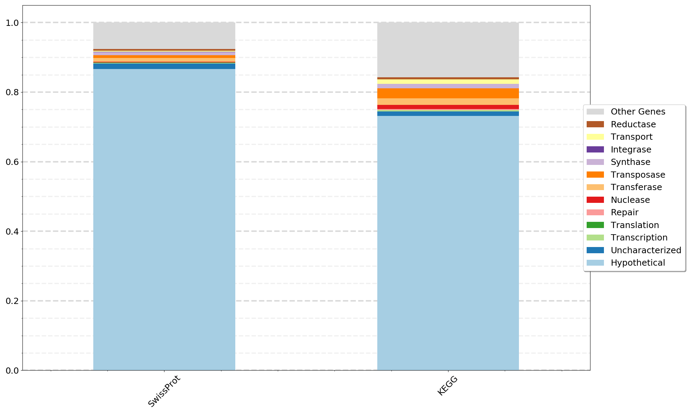

# Annotation Pipeline for TrEMBL, UniProt, and KEGG

This is a workflow for annotating amino acid sequences in fasta format using
the three databases. Includes steps to download and parse the
databases to match database query results with the annotation information as well as steps to combine, filter, and summarize the results. This workflow produces tables in tab separated value (tsv) format for the annotation of results of each each database. tsv files can be easily opened in Excel, or imported into Python with Pandas or read into R for further analysis. There is also an option to generate a stacked bar plot summary in .png format.

All of the Python scripts in this repository are written for Python version 3.6+. They can be executed and help output obtained by entering:

```bash
python scriptname.py -h
```

## Step 00: Required tools :: Python 3.6+, Blast+ (Blastp) and Kofamscan.

### Python 3.6+ for running the Python scripts in this repo.

Information for installing and running Python can be found [here](https://www.python.org/). I recommend installing [mini conda](https://docs.conda.io/en/latest/miniconda.html) first and then creating an environment for Python 3.6+ and other tools for the project at hand.

*All Python scripts in this repo were written for Python 3.6+. If you get a syntax error the first time you run a script, please first check your Python version.*

### Kofamscan

Kofamscan and hmm databases can be downloaded from the Download section of [this
page](https://www.genome.jp/tools/kofamkoala/).
The publication is [here](https://academic.oup.com/bioinformatics/advance-article/doi/10.1093/bioinformatics/btz859/5631907).


Or Kofamscan can be easily installed using a [conda environment](https://docs.conda.io/en/latest/miniconda.html):

```bash
conda create -n kofamscan hmmer parallel
conda activate kofamscan
conda install -c conda-forge ruby
```

### Blast+ or Diamond

Installation Details for Blast+ can be found [here](https://blast.ncbi.nlm.nih.gov/Blast.cgi?PAGE_TYPE=BlastDocs&DOC_TYPE=Download).

Or Blast+ can be easily installed using a [conda environment](https://docs.conda.io/en/latest/miniconda.html):

```bash
conda create -n blastplus
conda activate blastplus
conda install bioconda::blast=2.7.1 conda-forge::gnutls conda-forge::nettle
```

Installation Details for Diamond can be found [here](https://github.com/bbuchfink/diamond) or [here](http://www.diamondsearch.org/index.php). The publication can be found [here](https://www.nature.com/articles/nmeth.3176).

Or Diamond can be easily installed using a [conda environment](https://docs.conda.io/en/latest/miniconda.html):

```bash
conda create -n diamond
conda activate diamond
conda install -c bioconda diamond
```

## Step 01: Download and parse databases.

There are various ways to download the databases. A straighforward approach is simply with wget:

```bash
wget ftp://ftp.uniprot.org/pub/databases/uniprot/current_release/knowledgebase/complete/uniprot_sprot.fasta.gz
wget ftp://ftp.uniprot.org/pub/databases/uniprot/current_release/knowledgebase/complete/uniprot_sprot.dat.gz
wget ftp://ftp.uniprot.org/pub/databases/uniprot/current_release/knowledgebase/complete/uniprot_trembl.fasta.gz
wget ftp://ftp.uniprot.org/pub/databases/uniprot/current_release/knowledgebase/complete/uniprot_trembl.dat.gz
wget 'https://www.genome.jp/kegg-bin/download_htext?htext=ko00001&format=htext&filedir=' -O ko00001.keg
```

Need to make blast databases for SwissProt and TrEMBL fasta sequences.

```bash
makeblastdb -dbtype prot -in uniprot_sprot.fasta
makeblastdb -dbtype prot -in uniprot_trembl.fasta
```

I wrote some python code to parse these database .dat files for use downstream (Parsing the TrEMBL.dat file can take 3-4 hours).

```bash
python 01a_Parse_UniProtDBs_datFile.py -i uniprot_sprot.dat -o uniprot_sprot.PARSED.dat.tsv
python 01a_Parse_UniProtDBs_datFile.py -i uniprot_trembl.dat -o  uniprot_trembl.PARSED.dat.tsv
```

## Step 02: Run Blastp or Kofamscan as desired.

For this step you need genes / proteins as amino sequences in fasta format for the input_fasta file. The [Prodigal](https://github.com/hyattpd/prodigal/wiki/introduction) tool can be used to predict genes and write the sequence as amino acids in fasta format if you do not already have genes sequences to annotate.

#### Blastp with Blast+ or Diamond (Sword should also work with some adjustments).

The TrEMBL database is large and can take a really long time to search against. Alternative tools such as Diamond or Sword can be used instead of Blastp to speed up the search as long as tabular output is obtained with the qlen (query length) and slen (subject length) columns. Additionally, a computer cluster is highly useful here to run many searches at once. The protein sequence fasta file can be split up into smaller files containing 10 to 50 genes each, and each small file can be run through Blastp using 1 or cores. With the computer cluster you can utilize many cores to run numerous smaller fasta files simultaneously to greatly reduce the time required for sequence searches against the TrEMBL database.

The SwissProt database is much smaller and is more tractable without access to a computer cluster. If you do not have cluster access we recommened to skip the TrEMBL database and explore only SwissProt and KEGG.

If using Blast+, the Blastp algorithm can be run similar to this:

*(the custom -outfmt 6 format order with added query length and sequence length in columns 13 and 14 is **required** for filtering of downstream results.)*

```bash
blastp -task 'blastp' -evalue 0.01 -max_target_seqs 10 -num_threads 2 -db {pathto_db} -query {input_fasta} -out {outfile_name} -outfmt '6 qseqid sseqid pident length mismatch gapopen qstart qend sstart send evalue bitscore qlen slen'
```

Running Diamond is very similar:

*(If using diamond, be sure to use diamond for makedb in Step 01 instead of the Blast+ makeblastdb command).*

```bash
diamond blastp -d uniprot_sprot.fasta.dmnd -q input.faa -o input.dblastp -p 7 --outfmt 6 qseqid sseqid pident length mismatch gapopen qstart qend sstart send evalue bitscore qlen slen
```

#### Kofamscan

Kofamscan can be run with default settings like this:

```bash
ruby exec_annotation -o {outfile_name} {input_fasta}
```

## Step 03: Filter Results and retrieve annotation information.

There are various ways to filter results and many ideas on which cut offs to use. For blastp, I'm selecting a "best hit" based on the bitscore. For Kofamscan I'm choosing only the matches assigned an asterisks indicating they are above precomputed thresholds for high quality matches to the hmm model. For blastp I've assigned parameters to choose a percent match length (alignment length / query length) and percent sequence identity.

For blastp using either TrEMBL or UniProt databases:

```bash
python 03a_BlastTab_BestHit_Filter.py -i {tabular_blastp_output} -pml 50 -pid 40
python 03b_BlastTab_UniProtID_to_Gene_Annotation.py -p uniprot_sprot.PARSED.dat.tsv -b {filtered_blastp_output_forSwissProt} -o {outfile_name}
python 03b_BlastTab_UniProtID_to_Gene_Annotation.py -p uniprot_trembl.PARSED.dat.tsv -b {filtered_blastp_output_forTrEMBL} -o {outfile_name}
```

For Kofamscan:

```bash
python 03c_KofamScan_Filter_Convert.py -i {Kofamscan_output_file} -o {outfile_name}
```

At this point you have files containing results for each database in tab separated values (tsv) format. You can continue with your own analysis from here, or proceed to below for some additional plots to summarize the gene annotations.

## Step 04: Combine results and add unannotated genes.

At this point all the annotation information is in the .tsv files from Step 03. You can work with those files as is without finishing the pipeline. The remaining pipeline is useful for generating broad summaries of gene annotations and comparing them between databases or the same database between MAGs (or genomes or metagenomes).

#### If using a single database for annotation and comparing multiple MAGs, genomes or metagenomes:

*If you are only working with results from a single database you can skip 04a_Combine_Annotations.py, move on to 04b_Add_Unannotated_Genes.py, bypass Step 05 and 06, and proceed with Step 07 to visualize annotation differences between MAGs, genomes, or metagenomes.*


The first thing to know when comparing annotations results, is how many genes did not recieve an annotation above the filters used.

This current step will combine the .tsv files from step 03 and also add to the file any genes that did not recieve an annotation above the thresholds as "Hypothetical Genes".


#### If comparing results from two or three databases for a single MAG, genome or metagenome combine annotion results from each database:

The 04a_Combine_Annotations.py script is used to combine results from two or three databases to visualize the differences between databases in Step 05 and 06. If only using two database simply omit the third database when entering the command. This script writes a series of output files:

*The output file name specified contains all the annotation information. Use this file for Steps 04b, 05, and 06.*


*Not all genes recieve a gene annotation passing the filters. Some genes may get an annotation from only one database or two databases and some may get an annotation from all three. This script writes outputs for these genes in case you would like to explore them further. Otherwise you can ignore these files*

* single files contain genes with an annotation result from only one database
* double files contain genes with annotation results from two databases
* triple files contain genes with annotation results from all three databases

```bash
python 04a_Combine_Annotations.py -spb Step03_SwissProt_Annotations.tsv -kfs Step03_KEGG_Annotations.tsv -trb Step03_TrEMBL_Annotations.tsv -o Step04a_Combined_Annotations.tsv
```

#### Add un-annotated genes to the list.

When comparing annotations results, it is important to keep track of how many genes did not recieve an annotation above the filters used. The 04b_Add_Unannotated_Genes.py script reads through the original amino acid sequence fasta file and inserts any genes missing an annotation as a "Hypothetical Gene". The -a flag annotation file can be a single annotation output file from Step 03 or a combined annotation output file from Step 04.

```bash
python 04b_Add_Unannotated_Genes.py -a Annotation_file.tsv -q Original_AminoAcidSequence.fasta -o Step04b_Annotations_plusHypotheticals.tsv -d SwissProt KEGG TrEMBL
```

## Step 05: Transform combined results file. 

Transform the annotation files. This transformation will make it easier to read the combined annotation file. They are great for exploratory analysis. You can open them with Excel to read through them, or you can read them in as a dataframe with Pandas in Python or with R.

```bash
python 05a_Transform_Annotation_Results.py -a Step04b_Combined_Annotations_plusHypotheticals.tsv -o Step05_transformed_annotation_results.tsv -d SwissProt KEGG TrEMBL
```

## Step 06: Plot a summary of the combined results.

This step uses a list of desired gene types to count the number of genes of that type and build a stacked bar plot of the results for each database.

Create a list of gene types to count with columns "Legend Name, String to Match, Color" separated by a comma and a space. The file should include the column names. There is a default colorset of 14 colors if you which to leave the color column blank. If you want to choose your own colors, I recomend [Color Brewer](http://colorbrewer2.org/) for help with color palettes.

The plot generating script below reads the list of gene types and performs a string match. Matches are not case sensitive. Use "|" for or to count multiple variations as one type. Each gene is counted only once. Gene will be counted in the first category on the list that it matches.

Example Gene_Types_List.txt

    Legend Name, String to Match, Color
    Hypothetical, hypothetical, #a6cee3
    Uncharacterized, uncharacterized, #1f78b4
    Transcription, transcriptional|transcription|transcriptase, #b2df8a
    Translation, translation, #33a02c
    Repair, repair, #fb9a99
    Nuclease, nuclease, #e31a1c
    Transferase, transferase, #fdbf6f
    Transposase, transposase, #ff7f00
    Synthase, synthase, #cab2d6
    Integrase, integrase, #6a3d9a
    Transport, transport, #ffff99
    Reductase, reductase, #b15928

*The -c flag is to control the number of columns the legend is displayed with if your gene list gets too long.*

Build the stacked bar plots.

```bash
python 06a_CompareDatabases.py -i Step05_transformed_annotation_results.tsv -l Gene_Types_List.txt -c {num_legend_columns} -o {outfile_name} -d SwissProt KEGG TrEMBL
```

Example plot:


Example plot:


## Step 07: Plot a summary of single database results for one or more MAGs, genomes, or metagenomes.

This step uses the same Gene_Types_Lists.txt from Step 06 above but plots results for a single database as a stacked bar plot for one or more MAGs, genomes, or metagenomes. This annotation pipeline can be run multiple times with different input amino acid sequence fasta files for each MAG, genome, or metagenome and the results from Step 04b using a single database can be input into 07a_CompareSequences_Annotation_Results.py. 

* -i can be a single file or a list of files from Step04b_Annotations_plusHypotheticals.tsv
* The plot uses the filename as x-axis labels so if you label the Step04b output as SampleName.tsv or MAG_name.tsv the labels will look good.
* dbused should be one of KEGG TrEMBL SwissProt that you used for Step 03. The same database must be used for all files input with -i.

```bash
python 07a_CompareSamples.py -i file1 file2 file3 filen -l Gene_Types_List.txt -d {dbused} -o {outfile_name}
```

Example plot:


Example plot:


